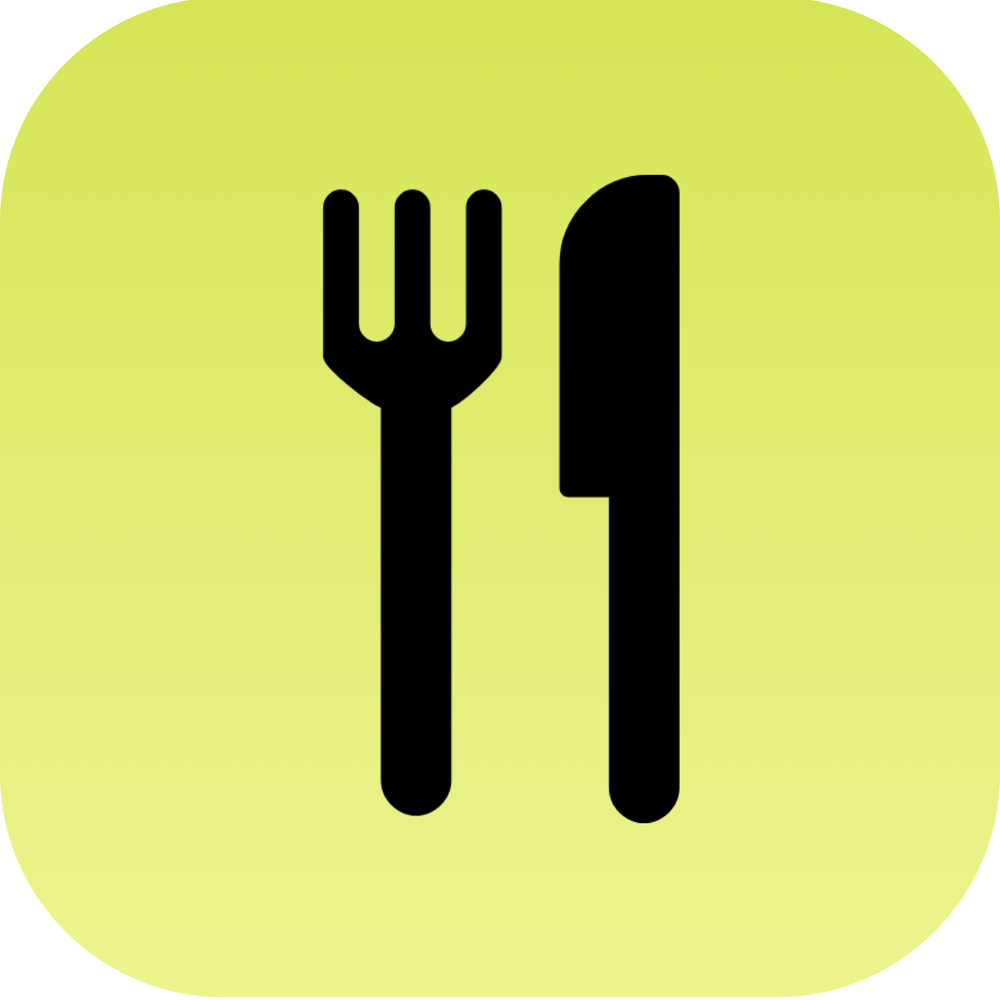
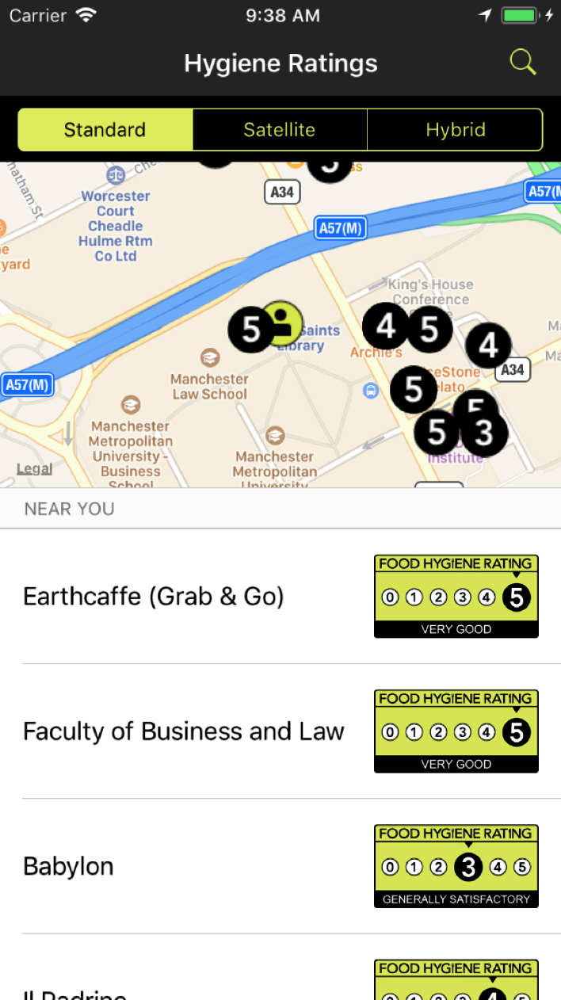
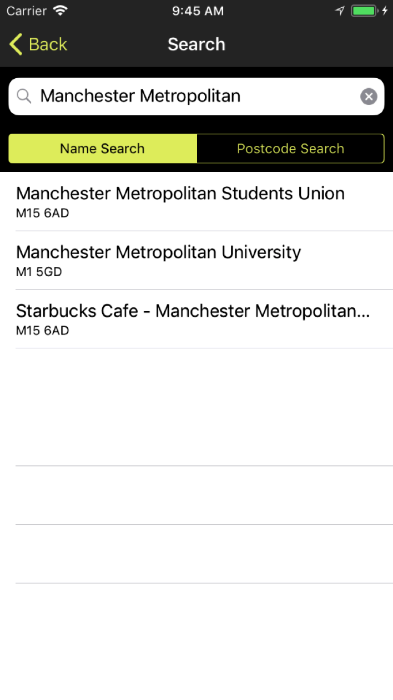
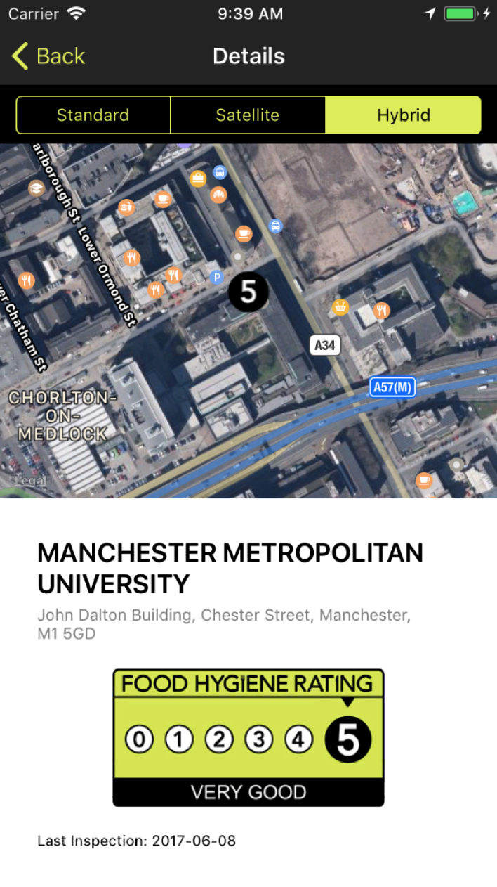

# Food Hygiene Ratings
Food Hygiene Ratings is an iOS application that provides the ability to search and display the hygiene ratings of UK businesses. This app was created as part of a University project.

# Features
- View hygiene ratings of nearby businesses and eateries
- Map style toggle (switch between a standard view, satellite view or a hybrid of the two)
- Search for an eatery by name or by postcode
- Details screen provides more specific information

# Screenshots

# Credits
Hygiene Rating Icons created by the [Food Standards Agency](http://ratings.food.gov.uk/open-data/en-GB)
